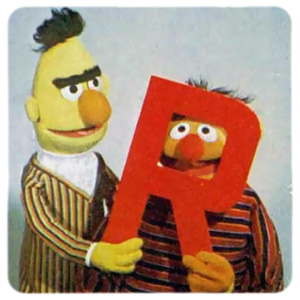
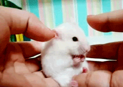
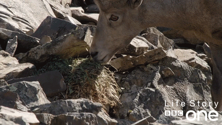
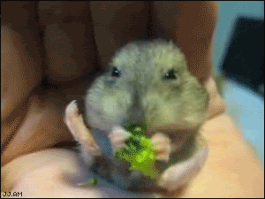
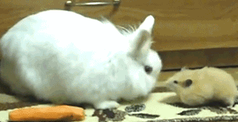
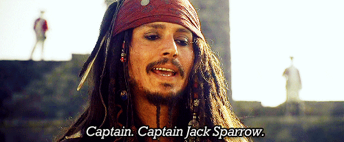
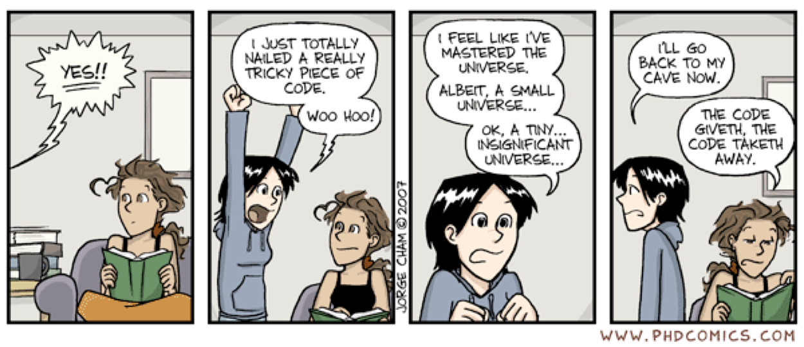

```{r setup, include=FALSE}
knitr::opts_chunk$set(message = FALSE, warning = FALSE, comment = NA, cache = FALSE, fig.width = 6, fig.align = "center")
options(tibble.print_max = 20)

```

```{r include=FALSE}
if(file.exists("../xaringan_reveal_parentheses_balanced.R")){
  source(file = "../xaringan_reveal_parentheses_balanced.R")
} else {
  source(file = "https://raw.githubusercontent.com/EvaMaeRey/little_flipbooks_library/master/xaringan_reveal_parentheses_balanced.R")
}

```

<style>

.left-column {
  color: #777;
  width: 20%;
  height: 92%;
  float: left;
}
.left-column h2:last-of-type, .left-column h3:last-child {
  color: #000;
}
.right-column {
  width: 75%;
  float: right;
  padding-top: 1em;
}
.pull-left {
  float: left;
  width: 47%;
}
.pull-right {
  float: right;
  width: 47%;
}
.pull-right ~ * {
  clear: both;
}

.vertical-center-100 {
  position: absolute;
  top: 50%;
  left: 50%;
  transform: translate(-50%,-50%);
  width: 100%
}

kbd {
    background-color: #eee;
    border-radius: 3px;
    border: 1px solid #b4b4b4;
    box-shadow: 0 1px 1px rgba(0, 0, 0, .2), 0 2px 0 0 rgba(255, 255, 255, .7) inset;
    color: #333;
    display: inline-block;
    font-size: .85em;
    font-weight: 700;
    line-height: 1;
    padding: 2px 4px;
    white-space: nowrap;
}

</style>

# **What are we doing?**

.pull-left[
The term `R` is used to refer to both the programming language and the software that interprets the scripts written using it.

`RStudio` is currently a very popular way to not only write your R scripts but also to interact with the R software. To function correctly, RStudio needs R and therefore both need to be installed on your computer.
]

.pull-right[

]

---

# **Where are we going**

.pull-left[
- Creating objects in R
- Vectors and data types
- Subsetting vectors
- Missing data
- Data frames
- Indexing and subsetting data frames
- Factors
]

---

# **Why R**

.pull-left[
- Does not involve lots of pointing and clicking, and that’s a good thing
- Great for reproducibility
- Interdisciplinary and extensible
- Works on data of all shapes and sizes
- Produces high-quality graphics
- Large and welcoming community
- Open-source and cross-platform
- Free, legally free!
]

.pull-right[

]

---

# **Why RStudio**

- Integrated Development Environment (IDE) for working with R
- Open-source and cross-platform
- Free, legally free!
- Write code, navigate files, inspect variables, and visualize plots.
- Also used for other things (version control, developing packages, writing Shiny apps)

---

# **Help**

.pull-left[
Nametags: Flip your nametags to the red end

Help Documentation: e.g. `?round`, `args(round)`, `??rounding`

Cheatsheet: http://github.com/rstudio/cheatsheets/raw/master/base-r.pdf
]

.pull-right[

]

---

# **Challenge**

What are the values after each statement in the following?

```{r eval=FALSE}
mass <- 47.5            # mass?
age  <- 122             # age?
mass <- mass * 2.0      # mass?
age  <- age - 20        # age?
mass_index <- mass/age  # mass_index?

```

---

# **Challenge**

We’ve seen that atomic vectors can be of type character, numeric (or double), integer, and logical. But what happens if we try to mix these types in a single vector?

<span>1.</span> What will happen in each of these examples? (hint: use `class()` to check the data type of your objects):

```{r eval=FALSE}
num_char <- c(1, 2, 3, "a")
num_logical <- c(1, 2, 3, TRUE)
char_logical <- c("a", "b", "c", TRUE)
tricky <- c(1, 2, 3, "4")

```

<span>2.</span> How many values in `combined_logical` are `"TRUE"` (as a character) in the following example:

```{r eval=FALSE}
num_logical <- c(1, 2, 3, TRUE)
char_logical <- c("a", "b", "c", TRUE)
combined_logical <- c(num_logical, char_logical)

```

---

# **Challenge**

<span>1.</span> Using this vector of heights in inches, create a new vector, `heights_no_na`, with the NAs removed.

```{r eval=FALSE}
heights <- c(63, 69, 60, 65, NA, 68, 61, 
             70, 61, 59, 64, 69, 63, 63, 
             NA, 72, 65, 64, 70, 63, 65)

```

<span>2.</span> Use the function `median()` to calculate the median of the `heights` vector.

<span>3.</span> Use R to figure out how many people in the set are taller than 67 inches.

---

# **Portal Data**

- Tabular dataset
- Observations of small mammals/reptiles/birds
- Collected over more than 40 years
- 24 plots of a desert ecosystem in Arizona
- Different experimental manipulations controlling which rodents are allowed to access which plot
- Real dataset, but simplified

---

# **Rodents**

.pull-left[


]

.pull-right[


]

---

# **Lizards**

.pull-left[


]

.pull-right[


]

---

# **Sparrows**

.pull-left[

]

.pull-right[


]

---

# **Research Questions**

- Is there a difference between the weight of male and female kangaroo rats?
- Do different species of kangaroo rats have different hindfoot lengths?
- How does hindfoot length relate to weight the weight of a kangaroo rat?
- How does the number of Kangaroo rats that get into the enclosure change over time?
- Is there a difference in the number of kangaroo rats that get into the different enclosures?

---

# **Setup**

We are studying the species repartition and weight of animals caught in plots in our study area.

```{r eval=FALSE}
# download the CSV file that contains the survey data from figshare
download.file(url="https://ndownloader.figshare.com/files/2292169",
              destfile = "data/portal_data_joined.csv")

```

```{r}
# load into memory the content of the CSV file as an object of class data.frame
surveys <- read.csv("data/portal_data_joined.csv")

```

---

# **Presentation of the Survey Data**

Each row holds information for a single animal.

| Column          | Description                        |
| --------------- | ---------------------------------- |
| record_id       | Unique id for the observation      |
| month           | Month of observation               |
| day             | Day of observation                 |
| year            | Year of observation                |
| plot_id         | ID of a particular plot            |
| species_id      | 2-letter code                      |
| sex             | Sex of animal (“M”, “F”)           |
| hindfoot_length | Length of the hindfoot in mm       |
| weight          | Weight of the animal in grams      |
| genus           | Genus of animal                    |
| species         | Species of animal                  |
| taxon           | e.g. Rodent, Reptile, Bird, Rabbit |
| plot_type       | Type of plot                       |

---

# Challenge

Based on the output of `str(surveys)`, can you answer the following questions?

1. What is the class of the object `surveys`?
2. How many rows and how many columns are in this object?
3. How many species have been recorded during these surveys?

---

# Challenge

1. Create a `data.frame` (`surveys_200`) containing only the data in row 200 of the `surveys` dataset.

2. Notice how `nrow()` gave you the number of rows in a `data.frame`?

  - Use that number to pull out just that last row in the data frame.
  - Compare that with what you see as the last row using `tail()` to make sure it’s meeting expectations.
  - Pull out that last row using `nrow()` instead of the row number.
  - Create a new data frame (`surveys_last`) from that last row.

3. Use `nrow()` to extract the row that is in the middle of the data frame. Store the content of this row in an object named `surveys_middle`.

4. Combine `nrow()` with the - notation above to reproduce the behavior of `head(surveys)`, keeping just the first through 6th rows of the `surveys` dataset.

---

# Challenge

1. Rename "F" and "M" to "female" and "male" respectively.
2. Now that we have renamed the factor level to "undetermined", can you recreate the barplot such that "undetermined" is last (after "male")?

---

# Challenge

<span>1.</span> We have seen how data frames are created when using `read.csv()`, but they can also be created by hand with the `data.frame()` function. There are a few mistakes in this hand-crafted `data.frame`. Can you spot and fix them? Don’t hesitate to experiment!

```{r eval=FALSE}
animal_data <- data.frame(
          animal = c(dog, cat, sea cucumber, sea urchin),
          feel = c("furry", "squishy", "spiny"),
          weight = c(45, 8 1.1, 0.8)
          )
```

---

# Challenge

<span>2.</span> Can you predict the class for each of the columns in the following example? Check your guesses using `str(country_climate)`:

  - Are they what you expected? Why? Why not?
  - What would have been different if we had added `stringsAsFactors = FALSE` when creating the data frame?
  - What would you need to change to ensure that each column had the accurate data type?

```{r eval=FALSE}
country_climate <- data.frame(
       country = c("Canada", "Panama", "South Africa", "Australia"),
       climate = c("cold", "hot", "temperate", "hot/temperate"),
       temperature = c(10, 30, 18, "15"),
       northern_hemisphere = c(TRUE, TRUE, FALSE, "FALSE"),
       has_kangaroo = c(FALSE, FALSE, FALSE, 1)
       )
```

---

# **Setup**

.pull-left[
`tidyverse` installs several packages useful for data analysis such as `tidyr`, `dplyr`, `ggplot2`, `tibble`, etc.

Let's load `lubridate`.

```{r eval=FALSE}
# install the tidyverse packages including dplyr
install.packages(tidyverse)

```

```{r}
# load the tidyverse package lubridate
library(lubridate)

```
]

.pull-right[

] 

---

class: middle

# **Epilogue**



---

class: middle

# **Thank You**

.pull-left[

]

.pull-right[

]

```{css, eval = TRUE, echo = F}
.remark-code{line-height: 1.5; font-size: 75%}
```

