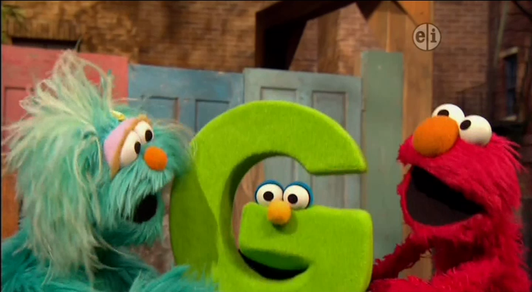
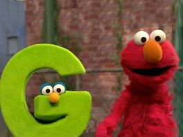
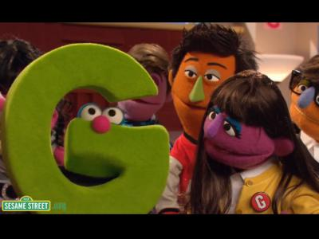
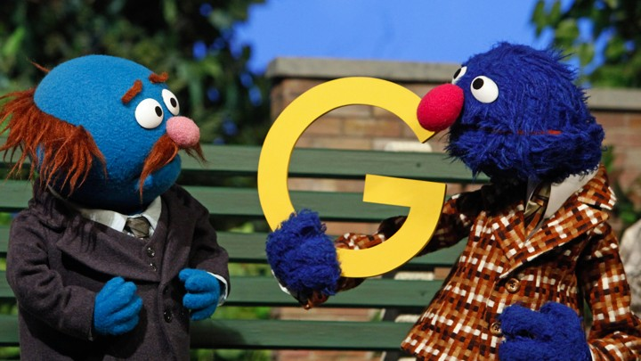
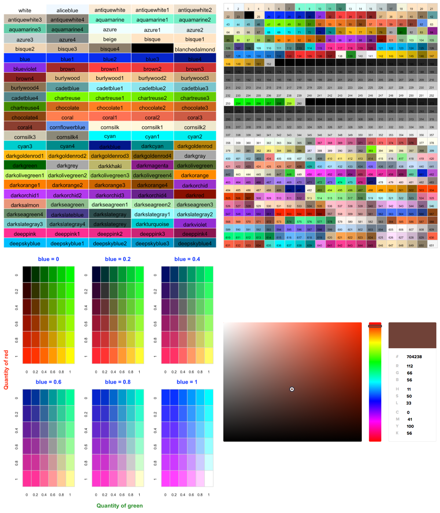
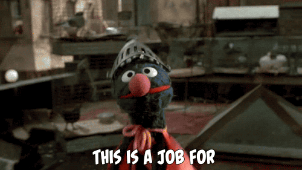

```{r setup, include=FALSE}
knitr::opts_chunk$set(message = FALSE, warning = FALSE, comment = NA, cache = FALSE, fig.width = 6, fig.align = "center")
options(tibble.print_max = 20)

```

```{r include=FALSE}
if(file.exists("../xaringan_reveal_parentheses_balanced.R")){
  source(file = "../xaringan_reveal_parentheses_balanced.R")
} else {
  source(file = "https://raw.githubusercontent.com/EvaMaeRey/little_flipbooks_library/master/xaringan_reveal_parentheses_balanced.R")
}

```

<style>

.left-column {
  color: #777;
  width: 20%;
  height: 92%;
  float: left;
}
.left-column h2:last-of-type, .left-column h3:last-child {
  color: #000;
}
.right-column {
  width: 75%;
  float: right;
  padding-top: 1em;
}
.pull-left {
  float: left;
  width: 47%;
}
.pull-right {
  float: right;
  width: 47%;
}
.pull-right ~ * {
  clear: both;
}

.vertical-center-100 {
  position: absolute;
  top: 50%;
  left: 50%;
  transform: translate(-50%,-50%);
  width: 100%
}

.center {
display: block;
margin-left: auto;
margin-right: auto;
}

kbd {
    background-color: #eee;
    border-radius: 3px;
    border: 1px solid #b4b4b4;
    box-shadow: 0 1px 1px rgba(0, 0, 0, .2), 0 2px 0 0 rgba(255, 255, 255, .7) inset;
    color: #333;
    display: inline-block;
    font-size: .85em;
    font-weight: 700;
    line-height: 1;
    padding: 2px 4px;
    white-space: nowrap;
}

#cf {
  position:relative;
  height:281px;
  width:450px;
  margin:0 auto;
}

#cf img {
  position:absolute;
  left:0;
  -webkit-transition: opacity 1s ease-in-out;
  -moz-transition: opacity 1s ease-in-out;
  -o-transition: opacity 1s ease-in-out;
  transition: opacity 1s ease-in-out;
}

#cf img.top:hover {
  opacity:0;
}

</style>

# **Setup**

.pull-left[
`tidyverse` installs several packages useful for data analysis such as `tidyr`, `dplyr`, `ggplot2`, `tibble`, etc.

Let's load the `tidyverse` including `ggplot2`.

```{r eval=FALSE}
# install the tidyverse packages including ggplot2
install.packages(tidyverse)

```

```{r}
# load the tidyverse packages including ggplot2
library(tidyverse)

```
]

.pull-right[

] 

---

# **Setup**

We are studying the species repartition and weight of animals caught in plots in our study area.

Let's read in the data using the `read_csv()` function from the `tidyverse` package `readr`.

```{r eval=FALSE}
# download the CSV file that contains the survey data from figshare
download.file(url="https://ndownloader.figshare.com/files/2292169",
              destfile = "data/portal_data_joined.csv")

```

```{r}
# load into memory the content of the CSV file as an object of class data.frame
surveys <- read_csv("data/portal_data_joined.csv")

```

---

# **Presentation of the Survey Data**

Each row holds information for a single animal.

| Column          | Description                        |
| --------------- | ---------------------------------- |
| record_id       | Unique id for the observation      |
| month           | Month of observation               |
| day             | Day of observation                 |
| year            | Year of observation                |
| plot_id         | ID of a particular plot            |
| species_id      | 2-letter code                      |
| sex             | Sex of animal (“M”, “F”)           |
| hindfoot_length | Length of the hindfoot in mm       |
| weight          | Weight of the animal in grams      |
| genus           | Genus of animal                    |
| species         | Species of animal                  |
| taxon           | e.g. Rodent, Reptile, Bird, Rabbit |
| plot_type       | Type of plot                       |

---

# **Review**

Bracket subsetting is handy, but it can be cumbersome and difficult to read, especially for complicated operations.

```{r}
table(surveys$species_id[!is.na(surveys$weight) | 
                         !is.na(surveys$hindfoot_length) |
                         !is.na(surveys$sex)])[table(surveys$species_id[!is.na(surveys$weight) |
                                                                        !is.na(surveys$hindfoot_length) |
                                                                        !is.na(surveys$sex)]) >= 50]

```

---

# **Review**

Bracket subsetting is handy, but it can be cumbersome and difficult to read, especially for complicated operations.

```{r}
surveys_complete <- surveys[!is.na(surveys$weight) | 
                            !is.na(surveys$hindfoot_length) | 
                            !is.na(surveys$sex),]
tab <- table(surveys_complete$species_id)
tab[tab >= 50]

```

---

# **Review** 

It is rare that we get the data in exactly the right form we need. Often we’ll need to create some new variables or summaries, or maybe we just want to rename the variables or reorder the observations in order to make the data a little easier to work with.

.pull-left[
```{r echo=TRUE, eval=FALSE}
surveys %>%
  filter(!is.na(weight), 
         !is.na(hindfoot_length),
         !is.na(sex)) %>% 
  count(species_id) %>% 
  filter(n >= 50)

```
]

.pull-right[
```{r echo=FALSE}
surveys %>%
  filter(!is.na(weight), 
         !is.na(hindfoot_length),
         !is.na(sex)) %>% 
  count(species_id) %>% 
  filter(n >= 50)

```
]

---

# **Where do we go from here**

---

class: middle


## "The simple graph has brought more information to the data analyst’s mind than any other device." **- John Tukey**

---

# **Where are we going**

```{r facetting, echo = FALSE, eval = FALSE}
surveys_complete %>%
  count(year, 
        genus, 
        sex) %>% 
  ggplot() +
  aes(x = year, 
      y = n, 
      color = sex) +
  geom_line() +
  facet_wrap(vars(genus)) +
  labs(title = "Observed genera through time",
       x = "Year of observation",
       y = "Number of individuals") +
  theme_bw() +
  theme(axis.text.x = element_text(colour = "grey20", 
                                   size = 12, 
                                   angle = 90, 
                                   hjust = 0.5, 
                                   vjust = 0.5),
        axis.text.y = element_text(colour = "grey20",
                                   size = 12),
        text = element_text(size = 16))

```

---

`r apply_reveal("facetting")`

---

# **How do we get there**

---

class: middle

### "…the grammar tells us that a statistical graphic is a **mapping** from data to **aesthetic** attributes (colour, shape, size) of **geometric** objects (points, lines, bars). The plot may also contain statistical transformations of the data and is drawn on a specific coordinate system" – from `ggplot2` book

---

# **g is for Grammar**

.pull-left[
- A grammar of a language defines the rules of structuring words and phrases into meaningful expressions.

- A good grammar is just the first step in creating a good sentence.
]

.pull-right[

]

---

# **g is for Grammar of Graphics**

.pull-left[
- A grammar of graphics defines the rules of structuring mathematic and aesthetic elements into a meaningful graph.

- A grammar may also help guide us on what a well-formed or correct graphic looks like, but there will still be many grammatically correct but nonsensical graphics. 
]

.pull-right[

]

---

# **g is for Grammar of Graphics**

.pull-left[
- A grammar of graphics is a tool that enables us to concisely describe the components of a graphic.

- A  grammar allows us to move beyond named graphics e.g. scatterplot and gain insight into the deep structure that underlies statistical graphics.

- Leland Wilkinson (2005) designed the grammar upon which `ggplot2` is based.
]

.pull-right[

]

---

class: middle

## "Base graphics are good for drawing pictures; ggplot2 graphics are good for understanding the data." **- Hadley Wickham**

---

# **g is for the ggplot2 package**

.pull-left[
- Creates layered statistical graphics.

- Uses an underlying grammar to build graphs layer-by-layer rather than providing premade graphs.

- Easy to use without any previous experience to the underlying grammar

- Builds a graph from concepts rather than commands and options
]

.pull-right[

]

---

class: middle

## "How we can build on the grammar to learn how to create graphical poems." **- Hadley Wickham**

---

# **g is for the ggplot function**

```{}
ggplot(data = <DATA>, mapping = aes(<MAPPINGS>)) +
  <GEOM_FUNCTION>(stat = <STAT>, position = <POSITION>) +
  <SCALE_FUNCTION>() + 
  <COORDINATE_FUNCTION>() +
  <FACET_FUNCTION>() +
  <THEME_FUNCTION>()

```

---

# **Elements of `G`rammar of `G`raphics**

1. **`Data`:** variables mapped to aesthetic features of the graph.

2. **`Aes`thetic mappings:** aesthetic features of the graph.

3. **`Geom`etric objects:** geometric objects/shapes on the graph.

4. **`Stat`istical tranformations:** stastical transformations that summarize data,(e.g mean, confidence intervals)

5. **`Position`:** adjusts the position of overlapping objects within a layer.

6. **`Scale`:** mappings of aesthetic values to data values. Legends and axes visualize scales.

7. **`Coord`inate systems:** the plane on which data are mapped on the graphic.

8. **`Facet`ting:** splitting the data into subsets to create multiple variations of the same graph (paneling).

9. **`Theme`:** makes the plot aesthetically pleasing or match an existing style guide

---

class: middle


## "The greatest value of a picture is when it forces us to notice what we never expected to see." **- John Tukey**

---

# **g is for `aes`thetics**

| Type	         | Argument |
| :------------- | :------- |
| Border Color	 | `color`  |
| Fill Color     | `fill`   |
| Transparency	 | `alpha`  |
| Grouping	     | `group`  |
| Linetype	     | `linetype` |
| Size           | `size`     |
| Point Shape    | `shape`    |
| Point Position | `x`, `y`, `xmin`, `xmax`, `ymin`, `ymax`, `xend`, `yend` |

---

# **g is for greens ... and reds ... and blues ...**

.pull-left[
`ggplot2` allows to customize the shape colors thanks to its `fill` and `color` arguments.

- **Name:** R offers about 657 color names. You can read all of them using `colors()`.
- **rgb:** The `rgb()` function allows to build a color using a quantity of red, green and blue. An additionnal parameter is available to set the transparency. All parameters ranged from 0 to 1.
- **Number:** Color can be defined by its number <br> e.g. `colors()[143]`.
- **Hex Code:** Colors can be defined by their hex code <br> e.g. `#69b3a2`. To find the hex code of your dream, visit this color picker.

For additional color pallettes, see R packages `RColorBrewer`, `viridis`, and `paletteer`.
A list of all the available palettes in R, see <https://github.com/EmilHvitfeldt/r-color-palettes>.
]

.pull-right[

]

---

# **g is for `aes`thetics**

.center[
.vertical-center-100[

]
]

---

# **g is for `aes`thetics**

```{r echo=FALSE}
ggplot2:::.all_aesthetics

```

---

# **g is for `geom`etric objects**

| Type	                    | Function                       |
| :------------------------ | :----------------------------- |
| Point	                    | `geom_point()`                 |
| Line	                    | `geom_line()`                  |
| Bar	                      | `geom_bar()`, `geom_col()`     |
| Histogram	                | `geom_histogram()`             |
| Regression	              | `geom_smooth()`                |
| Boxplot	                  | `geom_boxplot()`               |
| Violin                    | `geom_violin`                  |
| Jittered points           | `geom_jitter()`                |
| Text	                    | `geom_text()`                  |
| Diagonal Line             | `geom_abline()`                |
| Vertical/Horizontal Line	| `geom_vline()`, `geom_hline()` |
| Count	                    | `geom_count()`                 |
| Density	                  | `geom_density()`               |
| Ribbons and area plots    | `geom_ribbon()`, `geom_area()` |

---

# **g is for `geom`etric objects**

.center[
.vertical-center-100[

]
]

---

# **g is for `geom`etric objects**

.pull-left[
See <http://ggplot2.tidyverse.org/reference/>

```{r echo=FALSE}
ls(pattern = '^geom_', env = as.environment('package:ggplot2'))

```
]

.pull-right[
... or type `geom_` and RStudio will autocomplete


]

---

# **Faceting**

.pull-left[

]

.pull-left[

]

---

# **Themes**

.pull-left[
The `theme()` function of `ggplot2` allows to customize the chart appearance. It controls 3 main types of components:

- **Axis:** controls the title, label, line and ticks
- **Background:** controls the background color and the major and minor grid lines
- **Legend:** controls position, text, symbols and more.

See <http://ggplot2.tidyverse.org/reference/>
... or type `geom_` and RStudio will autocomplete

For additional themes, see R packages `ggthemes`, `ggthemr`, `hrbrthemes`, `ggpomological`, and `tvthemes`.
A list of all the available palettes in R, see <https://github.com/EmilHvitfeldt/r-color-palettes>.
]

.pull-right[

]

---

# **Help**

.pull-left[
Nametags: Flip your nametags to the red end

Help Documentation: e.g. `?ggplot`

Cheatsheet: https://github.com/rstudio/cheatsheets/raw/master/data-visualization-2.1.pdf
]

.pull-right[

]

---

# **g is for Getting Started**

We start by loading the required packages. `ggplot2` is included in the `tidyverse` package.

```{r}
library(tidyverse)

```

If not still in the workspace, load the data we saved in the previous lesson.

```{r eval=FALSE}
surveys_complete <- read_csv("data/surveys_complete.csv")

```

---

# **Challenges**

Use what you just learned to create a scatter plot of `weight over` `species_id` with `plot_types` showing in different colors. Is this a good way to show this type of data?

---

# **Challenges**

<!-- Boxplots are useful summaries, but hide the shape of the distribution. For example, if the distribution is bimodal, we would not see it in a boxplot. An alternative to the boxplot is the violin plot, where the shape (of the density of points) is drawn. -->

<!-- - Replace the box plot with a violin plot; see `geom_violin()`. -->

<!-- In many types of data, it is important to consider the scale of the observations. For example, it may be worth changing the scale of the axis to better distribute the observations in the space of the plot. Changing the scale of the axes is done similarly to adding/modifying other components (i.e., by incrementally adding commands). Try making these modifications: -->

<!-- - Represent weight on the log10 scale; see `scale_y_log10()`. -->

<!-- So far, we’ve looked at the distribution of weight within species. Try making a new plot to explore the distribution of another variable within each species. -->

<!-- - Create a boxplot for `hindfoot_length`. Overlay the boxplot layer on a jitter layer to show actual measurements. -->

<!-- - Add color to the data points on your boxplot according to the plot from which the sample was taken (`plot_id`). -->

<!-- Hint: Check the class for `plot_id`. Consider changing the class of `plot_id` from integer to factor. Why does this change how R makes the graph? -->

Create a visualization displaying a boxplot of `hindfoot_length` for each `species_id`. Modify the plot in the following way.

1. Do not display box plots for species with fewer than 50 total observations
2. Overlay the scatterplot on top of the box plot (`geom_jitter()`)
`geom_jitter()` will "jitter" points left and right, but also "jitter" the y-values of hind foot lengths. This is not good practice because we are actually changing the displayed measured values. Use the `geom_jitter()` option `height` such that "jitter" does not change the displayed hind foot length measurements.
3. Modify the transparency of the scatterplot such that the box plot is still visible. You may choose to change the color as well.
4. Notice that after overlaying the scatterplot, the outliers outside the boxplot are duplicated. Tell ggplot not to display the outliers from `geom_boxplot()`.
 

Hint: You may need to use `dplyr` for the first aim, and search in the options/documentation of `geom_boxplot()` to hide the outliers. Google may be of help too!

---

# **Challenge**

Use what you just learned to create a plot that depicts how the average weight of each species changes through the years.

---

# **Challenge: Recreate the Folowing Two Plots**

<!-- With all of this information in hand, please take another five minutes to either improve one of the plots generated in this exercise or create a beautiful graph of your own. Use the RStudio [**`ggplot2`** cheat sheet](https://github.com/rstudio/cheatsheets/raw/master/data-visualization-2.1.pdf) for inspiration. Here are some ideas: -->

<!-- - See if you can change the thickness of the lines. -->
<!-- - Can you find a way to change the name of the legend? What about its labels? -->
<!-- - Try using a different color palette (see http://www.cookbook-r.com/Graphs/Colors_(ggplot2)/). -->

.pull-left[
For the first plot, include the following modifications:

- The variable `weight` is on the log 10 scale
- x axis labels at a 45 angle
- Axes labels are x = "Genus" and y = "Weight (g)"

For the second plot, include the following modifications:

- Abundance is calculated for each year
- Lines colors are encoded by the variable `genus`
- Axes labels are x = "Year" and y = "Abundance"
]

.pull-right[

]

---

# **Challenge: Recreate the Folowing Two Plots**

<!-- With all of this information in hand, please take another five minutes to either improve one of the plots generated in this exercise or create a beautiful graph of your own. Use the RStudio [**`ggplot2`** cheat sheet](https://github.com/rstudio/cheatsheets/raw/master/data-visualization-2.1.pdf) for inspiration. Here are some ideas: -->

<!-- - See if you can change the thickness of the lines. -->
<!-- - Can you find a way to change the name of the legend? What about its labels? -->
<!-- - Try using a different color palette (see http://www.cookbook-r.com/Graphs/Colors_(ggplot2)/). -->

.pull-left[
For the first plot, include the following modifications:

- The variable `weight` is on the log 10 scale
- x axis labels at a 45 angle
- Axes labels are x = "Genus" and y = "Weight (g)"
]

.pull-right[
For the second plot, include the following modifications:

- Abundance is calculated for each year
- Lines colors are encoded by the variable `genus`
- Axes labels are x = "Year" and y = "Abundance"
]

.center[

]
---

# **g is for `grid.arrange` and `ggsave`**

The `gridExtra` package allows you to combine separate ggplots into a single figure using `grid.arrange()`. 

```{r eval=FALSE}
install.packages("gridExtra")

library(gridExtra)

```

The `ggsave()` function allows you easily change the dimension and resolution of your plot by adjusting the appropriate arguments (`width`, `height` and `dpi`) and save it to a file in the appropriate format.

---

class: middle

# **Epilogue**


---

class: middle

# **Epilogue**



---

# **Noteworthy RStudio Add-Ins**

- **esquisse:** Interactively build ggplot2 plots

- **ggplotThemeAssist:** Customize your ggplot theme interactively

- **ggedit:** Layer, scale, and theme editing

---

class: middle

# **Thank You**


---

# **Resources**

- ggplot2 Cheat sheet: <https://www.rstudio.com/wp-content/uploads/2016/11/ggplot2-cheatsheet-2.1.pdf>

- ggplot2: Elegant Graphics for Data Analysis, Hadley Wickham: <http://ggplot2.org>

- R Graphics Cookbook, Winston Chang: <http://www.cookbook-r.com/Graphs/>

- Naomi Robbins, Creating More Effective Graphs: <http://www.nbr-graphs.com>

- Antony Unwin, Graphical Data Analysis with R: <https://www.crcpress.com/Graphical-Data-Analysis-with-R/Unwin/9781498715232>

---

class: middle

# **g is for Goodbye**


---

```{css, eval = TRUE, echo = FALSE}
.remark-code{line-height: 1.5; font-size: 75%}
```

